# Multivariate-Analysis
## Aim
To write a python program to implement bivariate/multivariate analysis and predict the output.
## Equipment’s required:
1.	Hardware – PCs
2.	Anaconda – Python 3.7 Installation / Moodle-Code Runner
## Algorithm:
# step1
Numerical & Numerical
# step2
Numerical & Categorical
# step3
Multivariate Analysis
## PROGRAM
## CODE
```
from pandas.io.excel import read_excel
from pandas.io.parsers.readers import read_csv
import pandas as pd
import numpy as np
import seaborn as sns
import matplotlib.pyplot as plt
df = read_excel('FlightInformation.xlsx')
print(df)


sns.scatterplot(df['Date_of_Journey'])

sns.scatterplot(df['Duration'])

plt.figure(figsize=(17,7))
sns.scatterplot(df['Dep_Time'])

sns.barplot(x=df['Dep_Time'],y=df["Price"], data = df)

states=df.loc[:,["Dep_Time","Price"]]
states=states.groupby(by=["Price"]).sum().sort_values(by="Dep_Time")
plt.figure(figsize=(170,70))
sns.barplot(x=states.index,y="Dep_Time",data=states)
plt.xticks(rotation = 90)
plt.xlabel=("Price")
plt.ylabel=("SALES")
plt.show()

sns.barplot(x=df["Price"], y=df["Date_of_Journey"], data=df)

df.info()

states=df.loc[:,["Airline","Price"]]
states=states.groupby(by=["Airline"]).sum().sort_values(by="Price")
plt.figure(figsize=(17,7))
sns.barplot(x=states.index,y="Price",data=states)
plt.xticks(rotation = 90)
plt.xlabel=("Airline")
plt.ylabel=("Price")
plt.show()

df.corr()
sns.heatmap(df.corr(),annot=True)

```
## OUTPUT
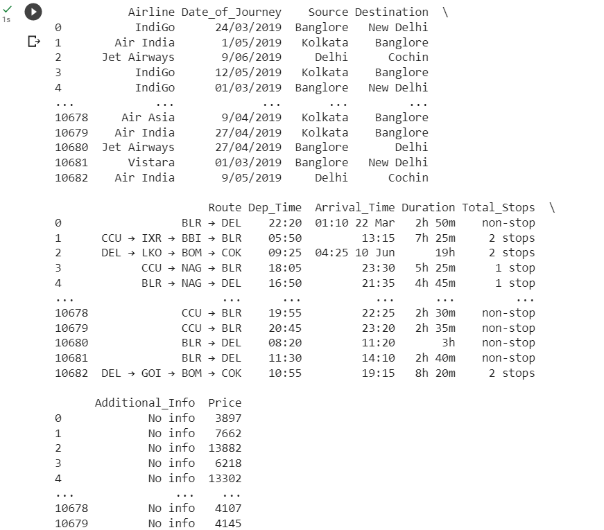
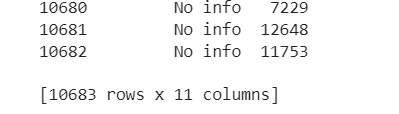
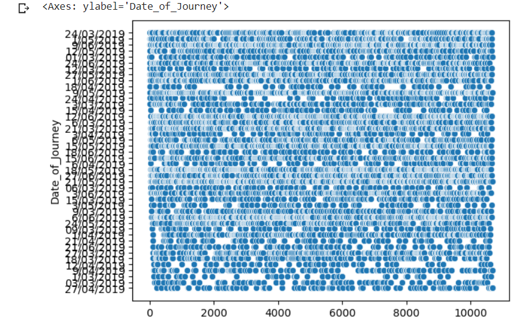
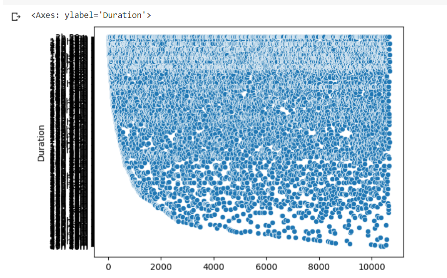
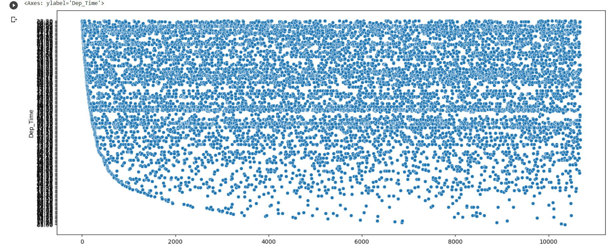
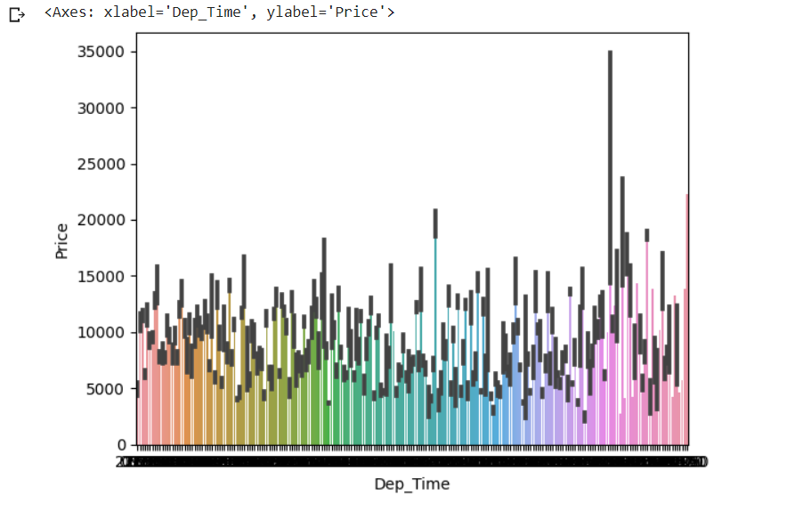
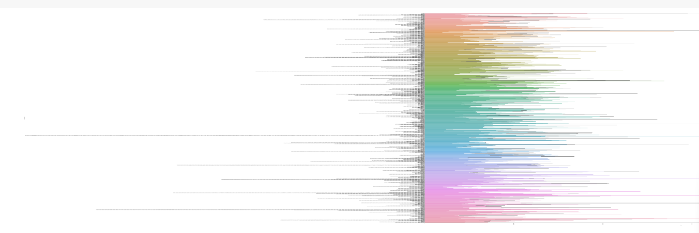
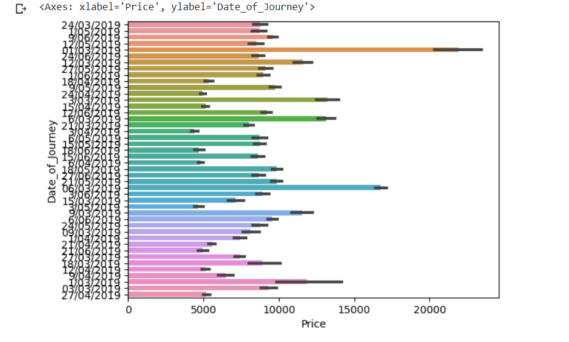
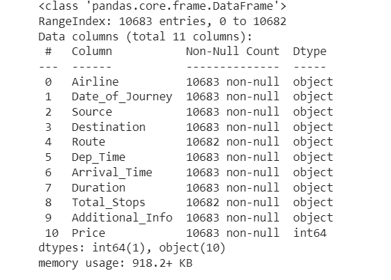
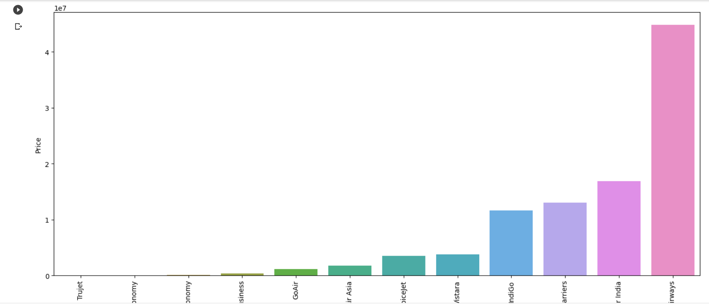
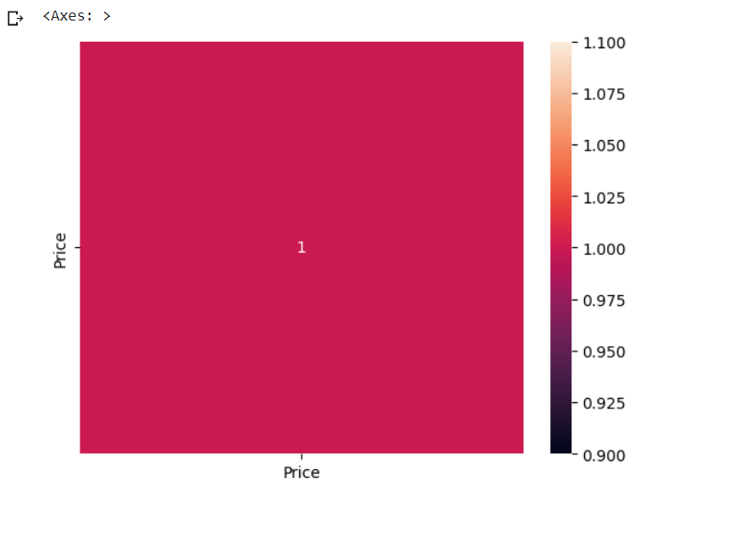

## RESULT
The output of the program is excicuted successfully